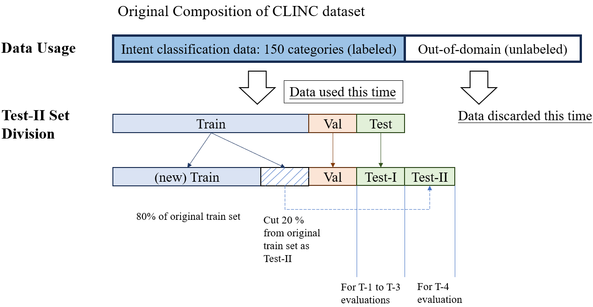
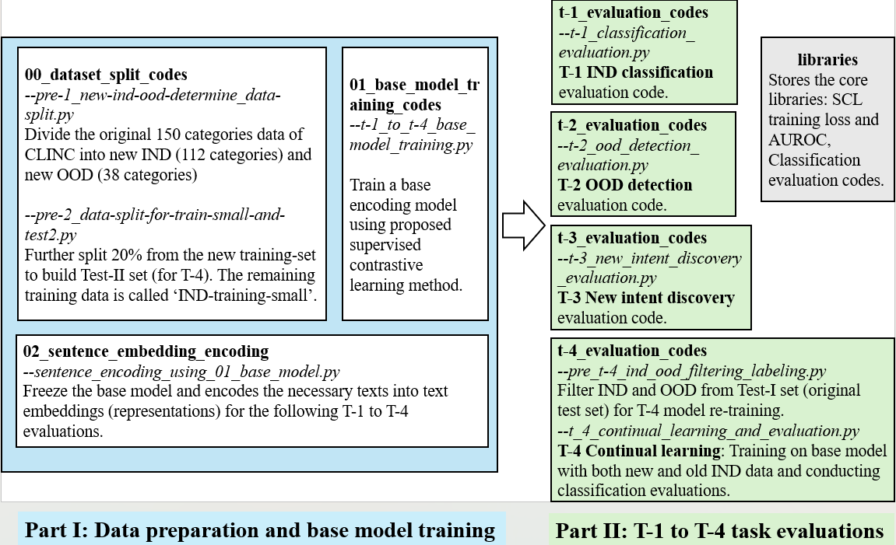

# scl-one-for-four
The codes for the paper: 'One Stone, Four Birds: A Comprehensive Solution for QA System Using Supervised Contrastive Learning', published on IEEE Access Journal Vol 12, 2024.

By running the demo code, it trains an upstream encoding model using proposed supervised contrastive learning on the CLINC [1] dataset. After building this model, the model parameter will be freezed to realize all four common tasks in a traditional question-answering (QA) system:

**T-1**: User input intent classification

**T-2**: Out-of-Domain (OOD) input detection

**T-3**: New intent discovery

**T-4**: Continual learning

To fit the evaluation needs of all four tasks this time, we conduct some further splits and processings on the original dataset, you may find the details in the Note section below.
In addition, for an instant use and easy reproduction, the original data has been converted into the numpy (.npy) format and is stored in `/data/clinc`. The description and copyright information for the CLINC dataset can be found [here](https://github.com/clinc/oos-eval).

During building the framework, this code also partially references the usage examples of sentence-bert [2] and supervised contrastive learning for image classification [3]. The original repositories for [sbert](https://github.com/UKPLab/sentence-transformers) and [supcon](https://github.com/HobbitLong/SupContrast) can be found at their respective links.

### Recommended Environment & Running Method:
These codes were originally running and tested on Python 3.7.6.

First, please install the necessary libraries by running:
```
pip install -r requirements.txt
```

Then, execute the bash file by:
```
chmod u+x run.sh
sh run.sh
```
All data splitting, model training, and task evaluations will run automatically.

### Note: 
1. How the new dataset is built on this experiment:

The original CLINC dataset is composed of an intent classification part and an oos (out-of-scope) part. Since we need to evaluate the accuracy of new intent discovery and final model re-training,
this time we discarded the unlabeled oos part, then divide the intent classification part (150 categories) into new IND (in-domain) 150*75%=112 categories and new OOD 38 categories.

In addition, to prevent data leakage and evaluate the final T-4 on all 150 categories, we further split 20% of training data above as Test-II dataset for final T-4 evaluation.


2. Code structure and short introductions:
The overall framework of this repository can be divided into two parts:

Part I: Data preparation and base model training

To train a base encoding model using proposed supervised contrastive learning method.


Part II: T-1 to T-4 task evaluations

To evaluate the effects of the trained model.



3. Notes on training: If you encounter issues with VRAM capacity, please adjust the `train_batch_size` in `a_supcon_model_training.py` to a lower value. As a reference, the default batch size of 512 requires approximately 35GB of VRAM.

### Reference:
If you find our study useful, please consider citing us:
```
@ARTICLE{wang2024one,
  author={Wang, Bo and Mine, Tsunenori},
  journal={IEEE Access}, 
  title={One Stone, Four Birds: A Comprehensive Solution for QA System Using Supervised Contrastive Learning}, 
  year={2024},
  volume={12},
  pages={148488-148501},
  doi={10.1109/ACCESS.2024.3469163}}
```
<span style="font-size: 10px;">
[1] Larson, S., Mahendran, A., Peper, J. J., Clarke, C., Lee, A., Hill, P., ... & Mars, J. . An Evaluation Dataset for Intent Classification and Out-of-Scope Prediction. EMNLP 2019 (pp. 1311-1316). <br>
[2] Reimers, N., & Gurevych, I. . Sentence-BERT: Sentence Embeddings using Siamese BERT-Networks. EMNLP 2019 (pp. 3982-3992). <br>
[3] Khosla, P., Teterwak, P., Wang, C., Sarna, A., Tian, Y., Isola, P., ... & Krishnan, D. . Supervised contrastive learning. NIPS 2020, 33, 18661-18673. <br>
</span>
